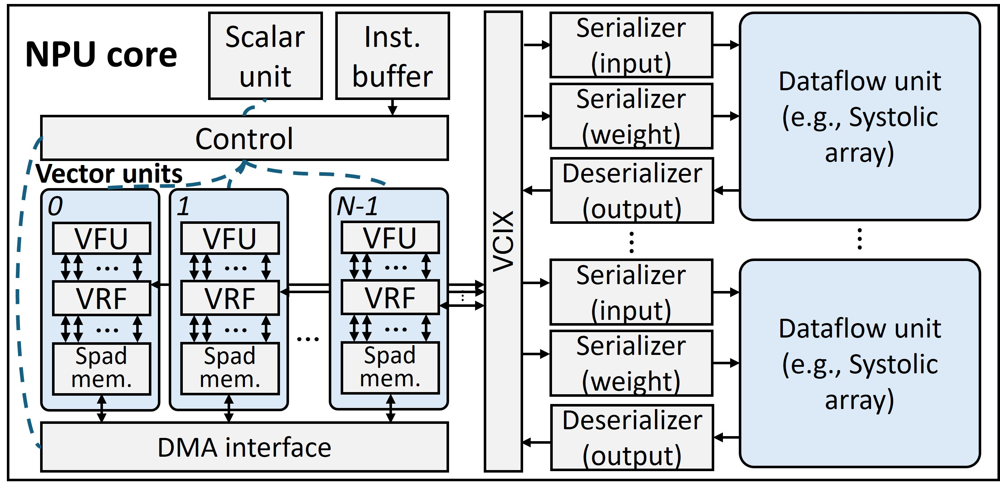

# PyTorchSim: A Comprehensive, Fast, and Accurate NPU Simulation Framework
[](https://github.com/PSAL-POSTECH/PyTorchSim/actions/workflows/docker-image.yml)

PyTorchSim is a comprehensive, high-speed, cycle-accurate NPU simulation framework.
- We define a RISC-V-based NPU architecture and implement PyTorch compiler backend to run inference & training for PyTorch models.
- Achieved high speed and accuracy with our novel Tile-Level Simulation (TLS) with compiler-generated Tile-Operation Graph (TOG), exploiting deterministic tile compute latency.
- A generic and extensible NPU architecture based on RISC-V vector extension.
- The functional simulator supports code correctness validation and data-dependent timing simulation.


For more details, please refer to our [paper](https://doi.org/10.1145/3725843.3756045)!

## Navigation
[Overview](#pytorchsim-framework-overview) | [Model Zoo](#model-zoo) | [Getting Started](#getting-started)

<!-- 
**Figure description**: we compare the simulation speed of PyTorchSim over [Accel-sim](https://accel-sim.github.io/) (a GPU simulator with Tensor Core model) as GPUs are widely used for deep learning and such a GPU simulator can be used to study systems for deep learning. We also include [mNPUsim](https://github.com/casys-kaist/mNPUsim) in the comparison. On the x-axis, we vary the size and workloads.


**Figure description**: PyTorchSim achieves significantly better accuracy than others ([SCALE-Simv3](https://github.com/scalesim-project/scale-sim-v3), [mNPUsim](https://github.com/casys-kaist/mNPUsim), [Timeloop](https://github.com/NVlabs/timeloop), [MAESTRO](https://github.com/maestro-project/maestro)) by supporting various optimizations, data transformations, and general vector operations. It achieved an 11.5% MAE (Mean Absolute Error) of runtime relative to the real TPUv3. -->

## PyTorchSim Framework Overview

PyTorchSim consists of **two main** components:
- **Compiler**: Integrated of [PyTorch2](https://github.com/pytorch/pytorch) compiler stack and generates NPU machine code and TOG for existing PyTorch models.
- **TOGSim**: Executes TOG for high-speed simulation and accurately models shared resources (DRAM, NoC) through integrated cycle-accurate simulators ([BookSim](https://github.com/booksim/booksim2) and [Ramulator2](https://github.com/CMU-SAFARI/ramulator2)).

PyTorchSim **supports**:
- DNN inference and [training](#training)
- Data-dependent timing modeling (e.g. sparsity)
- [Multi-tenancy](#multi-tenancy)
- [Compiler optimizations](#compiler-optimizations)
- [Mapping](#mapping)

## Model Zoo
| Model | Source | Status | Note |
|---|:-:|:-:|---|
| ResNet-18 |  | ✅ | channel last format |
| ResNet-50 |  | ✅ | channel last format |
| BERT |  | ✅ |  |
| GPT-2 |  | ✅ |  |
| ViT |  | ✅ |  |
| Mistral |  | ✅ | |
| Diffusion | 🤗 | ✅ |  |
| Llama-4 | 🤗 | ⏳ | Under Development |
| DeepSeek v1 | 🤗 | ⏳ | Under Development |
<!-- ## Requirements

### OS Distribution
Recommended: Ubuntu 22.04

### Tested Environment
```bash
gcc == 11.4.0
g++ == 11.4.0
cmake == 3.26.4
conan == 1.56.0
python >= 3.10
pytorch == 2.2.0
risc-v64-unknown-elf-gcc == 13.2.0
```
Our provided Docker environment resolves software dependencies.

### Hardware Dependencies
Any x86 hardware capable of running Docker with more than 20 GB of memory -->

## Supported Operations
- GEMM
- Batched GEMM
- Convolution
- Elementwise
- Reduction
- Batchnorm
- Layernorm
- Softmax
- Transpose
- View
- Activation
- Pooling

## Getting Started
### Quick start with pre-built Docker image

To download the latest Docker image and set up the environment, use the following commands:

```bash
# Run the Docker container
docker run -it --ipc=host --name torchsim -w /workspace/PyTorchSim ghcr.io/psal-postech/torchsim-ci:latest bash
```
### Run Examples
The `tests` directory contains several AI workloads examples.
```bash
python tests/test_matmul.py 
```
The result is stored to `TORCHSIM_DUMP_PATH/hash/backendsim_result/`. The log file contains detailed core, memory, and interconnect stats.

### Run Your Own Model on PyTorchSim
You can run your own PyTorch model on PyTorchSim by setting up a custom NPU device.  
This method also applies when you want to simulate models beyond the provided examples.
```python
import torch
from Scheduler.scheduler import ExecutionEngine
# Declare a custom NPU device
device = ExecutionEngine.setup_device().custom_device()

# Declare you own model (e.g. resnet18 from torchvision)
from torchvision.models import resnet18
model = resnet50().eval()

# Move model and input tensors to the custom device
model.to(device)
x.to(device)

# Compile and run the model with PyTorchSim
compiled_model = torch.compile(dynamic=False)(model)
y = compiled_model(x)
```
`model` is your PyTorch model to be simulated, and `x` is the input tensor.
PyTorchSim automatically generates a Tile-Operation Graph (TOG), and runs it through the TOGSim backend.

### Result
Running log in CLI
```bash
Wrapper Codegen Path = /tmp/torchinductor_root/yd/cyda7nhzv5mtakfhfcxtmmhtsv6kg7sza4k6wpkdgk7oxbpvqnlz.py
[Gem5Simulator] cmd>  /workspace/gem5/build/RISCV/gem5.opt -r --stdout-file=sto.log -d /tmp/torchinductor/tmp/fy6nnyudtno/m5out /root/workspace/PyTorchSim/gem5_script/script_systolic.py -c /tmp/torchinductor/tmp/fy6nnyudtno/cycle_bin --vlane 128
[Gem5Simulator] Simulation is still running... 
[SpikeSimulator] cmd>  spike --isa rv64gcv --varch=vlen:256,elen:64 --vectorlane-size=128 -m0x80000000:0x1900000000,0x2000000000:0x1000000 --scratchpad-base-paddr=137438953472 --scratchpad-base-vaddr=3489660928 --scratchpad-size=131072  --kernel-addr=0000000000010400:10846 --base-path=/tmp/torchinductor/tmp/fy6nnyudtno/runtime_0001 /workspace/riscv-pk/build/pk /tmp/torchinductor/tmp/fy6nnyudtno/validation_binary /tmp/torchinductor/tmp/fy6nnyudtno/runtime_0001/arg0_1/0.raw /tmp/torchinductor/tmp/fy6nnyudtno/runtime_0001/arg1_1/0.raw /tmp/torchinductor/tmp/fy6nnyudtno/runtime_0001/buf0/0.raw
[BackendSimulator] cmd>  /root/workspace/PyTorchSim/PyTorchSimBackend/build/bin/Simulator --config /root/workspace/PyTorchSim/PyTorchSimBackend/configs/systolic_ws_128x128_c1_simple_noc_tpuv3.json --models_list /tmp/torchinductor/tmp/fy6nnyudtno/tile_graph.onnx --attributes_list /tmp/torchinductor/tmp/fy6nnyudtno/runtime_0001/attribute/0
[BackendSimulator] Simulation is still running..  
[BackendSimulator] Simulation of "/tmp/torchinductor/tmp/fy6nnyudtno/tile_graph.onnx" is stored to "/tmp/torchinductor/tmp/fy6nnyudtno/backendsim_result/0"
----------------------------
|Matmul Forward Test Passed|
----------------------------
```

Simulation consists of three steps

1. `Gem5Simulator` obatins compute latency for TOG.
2. `SpikeSimulator` verifies the output code.
3. `BackendSimulator` simulates a NPU architecture.

If you want to turn off the `SpikeSimulator` for fast simulation, you can set as below.
```bash
export TORCHSIM_VALIDATION_MODE=False
```
Log contains memory & core stats.
```bash
[info] HBM2-CH_0: avg BW utilization 37% (255 reads, 128 writes)
[info] Row hits: 359, Row misses: 26, Row conflicts: 0
[info] ========= Core stat =========
[info] Core [0] : Systolic array [0] Utilization(%) 0.00, active cycle 0, idle cycle 1014
[info] Core [0] : Systolic array [1] Utilization(%) 12.62, active cycle 128, idle cycle 886
[info] Core [0] : TMA active cycle 3 TMA idle cycle 1011 DRAM BW 182.000 GB/s (6144)
[info] Core [0] : Vector Unit Utilization(%) 4.34, active cycle 44, idle_cycle 0
[info] Core [0] : Numa hit count : 0, Numa miss count : 0
[info] Core [0] : Total cycle 1014
[info] Total execution cycle: 1014
[info] Simulation time: 0.039296 seconds
```
The log is dumped in `TORCHSIM_DUMP_PATH` and you can set the path as below.
```bash
export TORCHSIM_DUMP_PATH=/tmp/torchinductor # output file dump path
```

## Training
`backward()` automatically generates TOG and executes simulation for backward propagation. If you want to simulate optimizers on NPU units, you can compile the optimizer’s step function.
```python
optimizer = torch.optim.Adam(model.parameters(), lr=0.001)
compiled_step = torch.compile(dynamic=False)(optimizer.step)

optimizer.zero_grad()
loss.backward()
opt_step()
```
`tests/test_mlp.py` provides an example of MLP training.

## Multi-tenancy
Our load generator supports multi-tenancy experiments. You can run a simple example by executing `tests/test_scheduler.py`.
```bash
python tests/test_scheduler.py
```
Below is an example code of multi-tenancy `resnet18` and `EncoderBlock`.
In this example, the `Scheduler` is initialized with a number of request queues, a scheduling policy, and a TOGSim config file(`.json`). The compiled PyTorch models are then registered with a unique model id.

```python3
import os
import sys
import torch
from torchvision.models import resnet18
from test_transformer import EncoderBlock
base_path = os.environ.get('TORCHSIM_DIR', default='/workspace/PyTorchSim')
config = f'{base_path}/PyTorchSimBackend/configs/systolic_ws_128x128_c2_simple_noc_tpuv3_partition.json'

sys.path.append(base_path)
from Scheduler.scheduler import Scheduler, SchedulerDNNModel, Request
scheduler = Scheduler(num_request_queue=2, engine_select=Scheduler.FIFO_ENGINE, backend_config=config)

# Register compiled model
target_model0 = resnet18().eval()
target_model1 = EncoderBlock(768, 12).eval()
opt_model0 = torch.compile(target_model0.to(device=scheduler.execution_engine.module.custom_device(), memory_format=torch.channels_last))
opt_model1 = torch.compile(target_model1.to(device=scheduler.execution_engine.module.custom_device()))
SchedulerDNNModel.register_model("model0", opt_model0)
SchedulerDNNModel.register_model("model1", opt_model1)
```

The config file(`.json`) specifies two key items:
- `num_partition`: The total number of independent request queues to create.
- `partition`: Defines the hardware mapping, assigning each queue (identified by its index) to a specific physical core.
For example, the configuration below creates two scheduling queues (`0` and `1`) and maps `core_0` to queue `0` and `core_1` to queue `1`:
```
  "num_partition" : 2,
  "partition": {
    "core_0":0,
    "core_1":1
  }
```

Next, DNN model requests are generated and submitted. We provide a `poisson_request_generator` utility, which generates request arrival times.
Each `Request` is created with its model name, data, and a request_queue_idx to specify its target queue, then added via `scheduler.add_request`.
As shown in the code, `model0` requests are queued to `request_queue_idx=0`, while `model1` requests are queued to `request_queue_idx=1`.
```python3
# Load Generation
model0_lambda = 5.0
model1_lambda = 3.0
max_time = 1000.0 # [s]

# Generate Possion distribution requests for model0
for model0_request_time in poisson_request_generator(model0_lambda, total_time=max_time):
    x = torch.randn(1, 3, 224, 224)
    new_request = Request("model0", [x], [], request_queue_idx=0)
    scheduler.add_request(new_request, request_time=model0_request_time)

# Generate Possion distribution requests for model1
for model1_request_time in poisson_request_generator(model1_lambda, total_time=max_time):
    x = torch.randn(128, 768)
    new_request = Request("model1", [x], [], request_queue_idx=1)
    scheduler.add_request(new_request, request_time=model1_request_time)
```

Finally, `scheduler.schedule()` is called in a loop until all requests are processed.
```python3
# Run scheduler
while not scheduler.is_finished():
    scheduler.schedule()
```

## Compiler Optimizations
PyTorchSim compiler supports several fusion optimizations:
- GEMM prologue fusion
- GEMM epilogue fusion
- GEMM reduction fusion
- CONV epilogue fusion

Depending on tensor shape, use different convolution template:
- Single batch optimization
- Multi-channel optimization

## Mapping
PyTorchSim provides three mapping strategies.
### Heuristic-based mapping
We adopt and modified heuristic-based mapping of [GEMMINI](https://github.com/ucb-bar/gemmini) by default, which maximizes the utilization of scratchpad memory.
### Auto-tuning
Heuristic method is not optimal for some cases. PyTorchSim provides auto-tuning to find best mapping for GEMM, CONV, and vector operations. It reduces searching space by sorting of scratchpad memory utilization and pick top-k candiates. Searching parameters are tile shape and vector lane stride.
```bash
export AUTOTUNE=True
```
### Manunal setting
User can exploit third-party(e.g. Timeloop) mapping. Set the cheatsheet path and write down their own mapping.

```bash
export CONFIG_GEMM_CHEATSHEET_PATH=validation/gemm_tpuv3_cheatsheet.json
```
Key: "M_K_N" for GEMM
```
{
    "512_2048_8192" : {
        "TILE_M" : 512,
        "TILE_K" : 512,
        "TILE_N" : 1024
    },
    "512_2048_2048" : {
        "TILE_M" : 512,
        "TILE_K" : 512,
        "TILE_N" : 1024
    },
    "2048_2048_512" : {
        "TILE_M" : 1024,
        "TILE_K" : 512,
        "TILE_N" : 512
    }
}
```
If you want to explore specific tile size, set the environment variable as below.
```bash
export TORCHSIM_MANUAL_TILE_SIZE=1
export TORCHSIM_TILE_M=512
export TORCHSIM_TILE_N=512
export TORCHSIM_TILE_K=512
```
## Compiler Configuration
`PyTorchSimFrontend/extension_config.py` contains target hardware configuration to compile.

You can configure these options using environment variables.
```bash
export TORCHSIM_VECTOR_LANE=128 # vector lane size
export TORCHSIM_VECTOR_LANE_STRIDE=2  # vector lane stride for DMA
export TORCHSIM_DIR=/workspace/PyTorchSim # home directory

export BLOCK_SPARSE=0 # If you want to use block sparse workload, turn it on

# Plan which tensor allocated in TPUv4's CMEM
export SRAM_BUFFER_PLAN_PATH=/workspace/PyTorchSim/tpuv4/gemm_plan.py

export TORCHSIM_TLS_MODE=1 # User can choose TLS or ILS mode
export TORCHSIM_USE_TIMING_POOLING=0 # use lightweight pooling for timing
```
## TOGSim Configuration


`PyTorchSimBackend/configs` directory contains example NPU configuration files in the JSON format.
```
  "num_cores" : 2,                   // Number of NPU cores
  "core_freq" : 940,                 // Core's frequency (MHz)
  "num_systolic_array_per_core" : 2, // Number of systolic array per core

  "dram_type" : "ramulator2",        // DRAM type (ex. ramulator2, simple)
  "dram_freq" : 940,                 // DRAM frequency (MHz)
  "dram_channels": 32,               // Number of DRAM channels
  "dram_req_size": 32,               // DRAM request size (B)
  "dram_latency" : 10,               // DRAM latency (cycle)
  "dram_nbl" : 2,                    // DRAM burst length size
  "dram_config_path" : "../configs/ramulator2_configs/HBM2_TPUv3.yaml", // Ramulator2 config file path

  "icnt_type" : "simple",            // Interconnect type (ex. booksim, simple)
  "icnt_latency" : 7,                // Interconnect latency (cycle)
  "icnt_freq" : 28000,               // Interconnect frequency (MHz)
  "icnt_config_path" : "../configs/booksim2_configs/fly_c4_m32.icnt", // Booksim2 config file path

  "precision" : 4,                   // Element's precision in tensor (Byte)
  "scheduler" : "simple",            // Scheduler type (Now, only support simple scheduler)
  "num_partition" : 2,               // Multi-core Partitioning
  "partition": {                     // allocate request queue index
    "core_0":0,
    "core_1":1
  }
```
You can set TOGSim config path as below.
```bash
export TORCHSIM_CONFIG=/workspace/PyTorchSim/PyTorchSimBackend/configs/systolic_ws_128x128_c1_simple_noc_tpuv3.json
```
## Future Works
Currently, PyTorchSim supports PyTorch 2.2. Support for newer versions will be added soon.

## Artifact Evaluation
Artifact evaluation is being prepared for v1.0.0.
The following scripts reproduce the validation and speedup results from the paper.
### Build
```bash
docker run -it --ipc=host --name torchsim -w /workspace/PyTorchSim ghcr.io/psal-postech/torchsim-ci:v1.0.0 bash
```

To generate validation results
```bash
# Run a cycle accuracy script
./experiments/artifact/cycle_validation/run_cycle.sh
```
To generate speedup results
```bash
# Run a speedup accuracy script
./experiments/artifact/speedup/run_speedup.sh
```

## Contributing
We welcome any contributions and issue reports. Contribution guideline will be posted.

## Citation
If you use PyTorchSim for your research, please cite the following paper.
```
@INPROCEEDINGS{yang2025pytorchsim,
  author={Yang, Wonhyuk and Shin, Yunseon and Woo, Okkyun and Park, Geonwoo and Ham, Hyungkyu and Kang, Jeehoon and Park, Jongse and Kim, Gwangsun},
  title={PyTorchSim: A Comprehensive, Fast, and Accurate NPU Simulation Framework},
  booktitle={Proceedings of the 58th IEEE/ACM International Symposium on Microarchitecture},
  pages={1363–1380},
  year={2025},
  doi={10.1145/3725843.3756045},
  series={MICRO '25}
}
```
